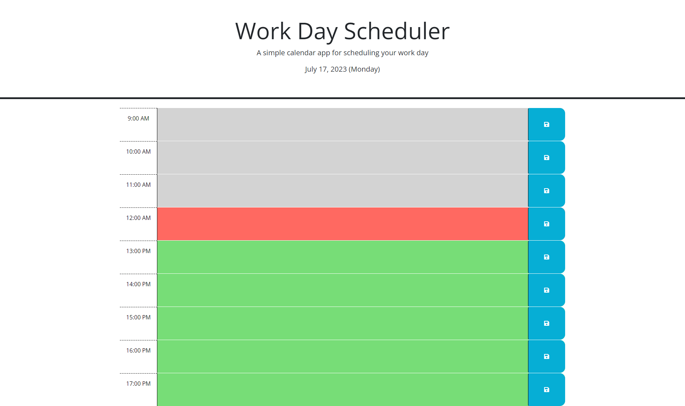

# scheduler-challenge-5

## Description
This project was created to make a simple calendar application.
A user can save events for each hour of a typical working day (9am-5pm).

When the user create a schedule as clicking the save button, that event is saved in local storage.
The events persist even after refreshing the page.

## Live link
[**https://yiseo.github.io/scheduler-challenge-5/**](https://yiseo.github.io/scheduler-challenge-5/)

## Screenshot

## Installation
N/A

## Technologies Used
- HTML
- CSS
- jQuery
- Github